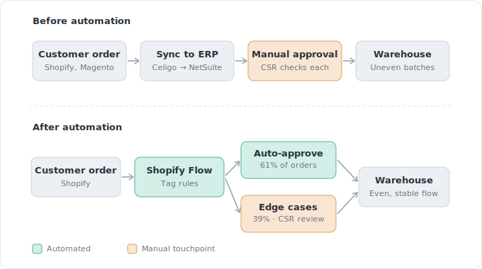

# Sales-Approval-to-Ship (SATS) Automation
**eCommerce Process Automation | Allowlist Risk Design | Shopify Flow · Celigo · NetSuite**

This repository documents a production process-automation project at **SCARPA North America**, where a manual, per-order approval gate between **Shopify, Celigo, and NetSuite** delayed fulfillment and forced uneven warehouse intake — and how an **allowlist-based** automation removed it without losing the safety the manual check originally provided.

The result: **61% of orders now ship with no manual approval.**

---

## Table of Contents
- [Context](#-context)
- [Problem](#-problem)
- [Goal](#-goal)
- [Approach](#-approach)
- [Implementation](#-implementation)
- [Rollout](#-rollout)
- [Results](#-results)
- [Iterations](#-iterations)
- [What This Demonstrates](#-what-this-demonstrates)

---

## 🧭 Context

Orders placed on SCARPA North America (**Magento**, later **Shopify**) flow into **NetSuite** via **Celigo**. Before fulfillment, every order required a customer service rep (CSR) to manually verify tax, price, discounts, inventory, and allocation, then check a **"Sales Approval to Ship"** boolean in NetSuite. That checkbox kicked off fulfillment.

The gate was **legacy**. It traces back to early Magento days, when inventory was inaccurate enough that orders couldn't safely auto-allocate — so each one got a manual visual check. By 2025 the inaccuracy was gone, but the manual step remained.

---

## 📉 Problem

The manual gate carried three compounding costs:

- **Delay** — every order waited on a human before it could ship.
- **Uneven warehouse intake** — CSRs approved in batches, so orders hit the warehouse in lumps instead of a steady stream.
- **Inflated CSR load** — team bandwidth (and headcount) was tied to a step that no longer earned its keep.

---

## 🎯 Goal

Automate the approval-to-ship decision to cut fulfillment delay, smooth warehouse intake, and free CSR capacity — **without losing the safety** the manual check originally provided.

---

## 🧠 Approach

**Allowlist, not blocklist.** Rather than auto-approving everything and hunting for problems, the system auto-approves only orders that clearly meet safe criteria and routes anything unusual to CSRs as edge cases — the existing manual path. This contained risk to a small, reviewable set instead of betting on catching every exception after the fact.

I first confirmed the gate was actually removable: a conversation with the **warehouse manager** to understand downstream impact, then with the **CFO** and the **Direct Sales Manager** to trace the gate's history and confirm it was no longer a real control. Only then did I design the automation. (See [Solution Design](solution-design.md) for the alternatives weighed and the full rationale.)

*Before: every order waits on a manual CSR approval, reaching the warehouse in uneven batches. After: Shopify Flow auto-approves the 61% that clearly qualify and routes the rest to the existing CSR path — the warehouse receives a steady, even flow.*

---

## 🔧 Implementation

Three layers, deliberately lightweight where possible:

1. **Shopify Flow** — evaluates each order against approval criteria and tags qualifying orders `sats-auto-approve`. No-code, so the rules stay easy to tune.
2. **Celigo** — updated the integration to detect the tag and carry the approval through to NetSuite.
3. **NetSuite** — the heaviest lift. Existing invoicing and fulfillment workflows only fired when the approval box was checked *manually*; they had to be updated to handle orders arriving already approved.

---

## 🚀 Rollout

Phased, with an observe-only first stage:

- Deployed the Shopify Flow and ran it for several weeks in **tag-only mode** — measuring what share of orders qualified, spot-checking for orders that *should* have tagged but didn't, and tuning the criteria.
- Edited Celigo and deployed to production.
- Hit **one failure** in production: NetSuite's invoicing/fulfillment flow still expected a manual check and broke on pre-approved orders. Reverted to staging, validated with live test orders from Shopify, and **redeployed within a day**.

The revert is documented here on purpose — a staging environment and a fast, clean rollback are the point, not a footnote.

---

## 📈 Results

- **61% of orders auto-approve** and ship with no manual touch.
- CSRs spend notably less time on approvals; that capacity returns to higher-value work.
- The warehouse manager confirmed order intake is materially more **consistent and stable**.
- Full quantification of time-to-fulfillment and labor savings is **in progress** — figures here will be updated as they're measured, not estimated.

---

## 🔁 Iterations

Live and maintained. Notable changes since launch:

| Date | Change |
|------|--------|
| May 18 | Go live |
| May 20 | Exclude PFAS-restricted orders from auto-tagging |
| May 21 | Exclude internal / dev (Forix) test orders |
| Jun 8 | Fix one-size hat edge case |
| TBD | Remove address-match requirement |

---

## 🧰 What This Demonstrates

- **Process design under real constraints** — auditing a legacy control before removing it, and containing risk via an allowlist instead of removing the safety net outright.
- **Cross-functional coordination** across ecommerce, customer service, warehouse, and finance.
- **Integration work** spanning Shopify Flow, Celigo, and NetSuite.
- **Disciplined rollout** — observe-only validation, staging, and fast recovery.
