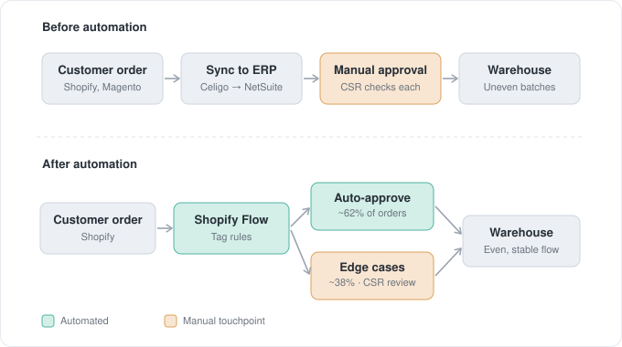

# Sales-Approval-to-Ship (SATS) Automation
**eCommerce Process Automation | Allowlist Risk Design | Shopify Flow · Celigo · NetSuite**

This repository documents a production process-automation project at **SCARPA North America**, where a manual, per-order approval gate between **Shopify, Celigo, and NetSuite** delayed fulfillment and forced uneven warehouse intake — and how an **allowlist-based** automation removed it without losing the safety the manual check originally provided.

The result: **62% of orders now ship with no manual approval**, and fulfillment is **26% faster** across the board.

---

## Table of Contents
- [Context](#-context)
- [Problem](#-problem)
- [Goal](#-goal)
- [Approach](#-approach)
- [Implementation](#-implementation)
- [Rollout](#-rollout)
- [Results](#-results)
- [Iterations](#-iterations)
- [Impact Analysis](impact-analysis.md) *(companion doc)*
- [What This Demonstrates](#-what-this-demonstrates)

---

## 🧭 Context

Orders placed on SCARPA North America (**Magento**, later **Shopify**) flow into **NetSuite** via **Celigo**. Before fulfillment, every order required a customer service rep (CSR) to manually verify tax, price, discounts, inventory, and allocation, then check a **"Sales Approval to Ship"** boolean in NetSuite. That checkbox kicked off fulfillment.

The gate was **legacy**. It traces back to early Magento days, when inventory was inaccurate enough that orders couldn't safely auto-allocate — so each one got a manual visual check. By 2025 the inaccuracy was gone, but the manual step remained.

---

## 📉 Problem

The manual gate carried three compounding costs:

- **Delay** — every order waited on a human before it could ship.
- **Uneven warehouse intake** — CSRs approved in batches, so orders hit the warehouse in lumps instead of a steady stream.
- **Inflated CSR load** — team bandwidth (and headcount) was tied to a step that no longer earned its keep.

---

## 🎯 Goal

Automate the approval-to-ship decision to cut fulfillment delay, smooth warehouse intake, and free CSR capacity — **without losing the safety** the manual check originally provided.

---

## 🧠 Approach

**Allowlist, not blocklist.** Rather than auto-approving everything and hunting for problems, the system auto-approves only orders that clearly meet safe criteria and routes anything unusual to CSRs as edge cases — the existing manual path. This contained risk to a small, reviewable set instead of betting on catching every exception after the fact.

I first confirmed the gate was actually removable: a conversation with the **warehouse manager** to understand downstream impact, then with the **VP Finance & Operations** and the **Direct Sales Manager** to trace the gate's history and confirm it was no longer a real control. Only then did I design the automation. (See [Solution Design](solution-design.md) for the alternatives weighed and the full rationale.)

*Before: every order waits on a manual CSR approval, reaching the warehouse in uneven batches. After: Shopify Flow auto-approves the ~62% that clearly qualify and routes the rest to the existing CSR path — the warehouse receives a steady, even flow.*

---

## 🔧 Implementation

Three layers, deliberately lightweight where possible:

1. **Shopify Flow** — evaluates each order against approval criteria and tags qualifying orders `SATS-auto-approve`. No-code, so the rules stay easy to tune.
2. **Celigo** — updated the integration to detect the tag and carry the approval through to NetSuite.
3. **NetSuite** — the heaviest lift. Existing invoicing and fulfillment workflows only fired when the approval box was checked *manually*; they had to be updated to handle orders arriving already approved.

---

## 🚀 Rollout

Phased, with an observe-only first stage:

- Deployed the Shopify Flow and ran it for several weeks in **tag-only mode** — measuring what share of orders qualified, spot-checking for orders that *should* have tagged but didn't, and tuning the criteria.
- Edited Celigo and deployed to production.
- Hit **one failure** in production: NetSuite's invoicing/fulfillment flow still expected a manual check and broke on pre-approved orders. Reverted to staging, validated with live test orders from Shopify, and **redeployed within a day**.

The revert is documented here on purpose — a staging environment and a fast, clean rollback are the point, not a footnote.

---

## 📈 Results

Measured Jan 1 – Aug 15, 2026, split on auto-approval going live May 19. Full methodology and limitations: **[Impact Analysis](impact-analysis.md)**.

- **62.2% of orders auto-approve** and ship with no manual touch — 3,203 of 5,147 orders since go-live, a rate that has held steady across seven criteria changes.
- **26% faster fulfillment** across all orders — 65 hrs median order-to-fulfillment before, 48 hrs after, at essentially unchanged daily volume.
- **30% faster on auto-approved orders specifically** — 43 hrs vs. 61 hrs for orders routed to manual review **in the same period**, which holds season, staffing, and warehouse conditions constant. Two independent comparisons, pointing the same direction.
- **55% lower chargeback rate** — 0.217% (17 / 7,834 orders) to 0.097% (5 / 5,147), roughly 6 chargebacks prevented against the prior rate. **Provisional:** disputes lag 30–90+ days, so the post-period cohort hasn't matured and this figure will decline. See [the caveat](impact-analysis.md#-chargeback-reduction).
- The warehouse manager confirmed order intake is materially more **consistent and stable**.
- CSR labor savings remain **unquantified** — the freed capacity is real and observed, but no time-tracking data supports a specific figure, so none is claimed.

---

## 🔁 Iterations

Live and maintained. The criteria were always going to need tuning, and most changes below didn't originate with me. Refinement runs as a standing loop: the **customer service coordinator** works the manual review queue and sees fraud patterns and edge cases first-hand; the **VP Finance & Operations** weighs intake and risk tolerance; the **VP** sets approval policy. I translate that into Flow logic, flag ambiguity in the requirement before building, and report back what each change does to the qualification rate.

| Date | Change | Raised by |
|------|--------|-----------|
| May 19 | Go live — auto-approval activated | — |
| May 20 | Exclude PFAS-restricted orders from auto-tagging | eCommerce (me) |
| May 21 | Exclude internal / dev (Forix) test orders | eCommerce (me) |
| Jun 8 | Fix one-size hat edge case | CS coordinator |
| Jun 26 | Exclude orders shipping to Delaware | CS coordinator |
| Jul 6 | Restrict auto-approval to US / CA billing addresses | CS coordinator |
| Jul 16 | Remove blanket billing/shipping address-match requirement | VP |
| Jul 16 | Require billing/shipping match on orders $400 and above | VP |

Three of these are worth more than a changelog line:

**One-size hats (Jun 8)** — small apparel was failing to auto-approve. The line-item size check had no handling for products without a numeric size, so hats fell out of the allowlist and into manual review for no real reason. Surfaced by the CS coordinator, who was clearing them by hand.

**Delaware (Jun 26)** — the CS coordinator flagged an abnormal cluster of fraudulent orders shipping to Delaware. A pattern only visible to someone working the review queue daily, not derivable from the Flow logic itself.

**Billing country (Jul 6)** — also from the CS coordinator, and not a fraud control. Orders routed through US freight forwarders present a domestic *shipping* address while the buyer is overseas. Gating on **billing** country catches them, keeping the automation aligned with SCARPA's subsidiary dealer guidelines — direct sales shouldn't auto-approve into territories served by SCARPA UK, SCARPA Germany, and the rest. The check is positively framed (`== US OR == CA`) so a missing billing address falls to review rather than slipping through.

## 🧰 What This Demonstrates

- **Process design under real constraints** — auditing a legacy control before removing it, and containing risk via an allowlist instead of removing the safety net outright.
- **Cross-functional coordination** across ecommerce, customer service, warehouse, and finance.
- **Integration work** spanning Shopify Flow, Celigo, and NetSuite.
- **Disciplined rollout** — observe-only validation, staging, and fast recovery.
