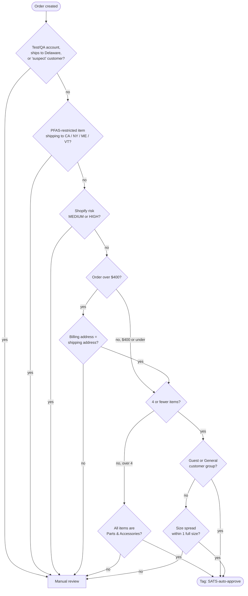

# SATS Automation — Flow Logic

**The auto-approval decision tree, as implemented in Shopify Flow**

A companion to the [main case study](README.md), the [solution design](solution-design.md), and the [impact analysis](impact-analysis.md). This document is the literal criteria the Shopify Flow evaluates on every order — the allowlist itself. It's the answer to *"what actually has to be true for an order to skip manual approval?"*

---

## 🧭 How to read this

The Flow is an **allowlist**: an order is auto-approved only if it clears *every* gate below. Anything that falls out at any gate isn't rejected — it drops to the same CSR manual-review queue that previously handled 100% of orders. Nothing fails to auto-approval; everything unusual fails to a human.

The gates are ordered cheapest-and-broadest first (a string check on email) to most expensive last (a line-item size computation), so the majority of manual-review orders exit early without running the later logic.

---

## 🌳 Decision tree

---

## 🔒 The gates, in order

### 1. Exclusion gate
Orders from internal QA / staff test accounts, orders shipping to **Delaware**, and customers carrying a `suspect` tag are pulled out before anything else runs.

- **Delaware** and **suspect** were added by the CS coordinator from patterns visible only in the daily review queue (see [Iterations](README.md#-iterations)).
- The test-account exclusion keeps QA and internal orders from polluting the auto-approve stream.

### 2. PFAS restricted-state gate
If any line item is tagged **PFAS** *and* the order ships to a state that restricts those products (**CA, NY, ME, VT**), it routes to manual review. This keeps the automation from auto-shipping regulated goods into states that don't allow them.

### 3. Risk gate
If Shopify's own fraud analysis flags the order **MEDIUM** or **HIGH** risk, it goes to a human. Only low-risk orders continue.

### 4. Address / value gate — *updated Aug 25, 2026*
- **Over $400:** billing and shipping address must match (normalized comparison, and the shipping address must contain a street number). A mismatch drops to manual review.
- **$400 or under:** the address-match check is skipped entirely.

This is a **risk-proportionate** control. Address match is a legitimate fraud signal, but strict equality fires on benign mismatches — gifts, apartment-field inconsistencies, work vs. home addresses. Requiring it only above $400 keeps the signal where the downside justifies the friction and stops it from blocking low-value good orders. See the [solution design](solution-design.md#6-address-match-risk-proportionate-not-blanket) for the full rationale, and the note below on why this is a `Run code` action rather than a native condition.

### 5. Quantity split
- **4 or fewer items** → customer-group branch (gate 7).
- **More than 4 items** → Parts & Accessories branch (gate 6).

### 6. Parts & Accessories (orders over 4 items)
A large multi-item order auto-approves only if **every** line item is a `Parts & Accessories` product. High-quantity footwear/apparel orders are exactly the reseller/fraud shape worth a human look; bulk small-parts orders are routine.

### 7. Customer group, then size spread (orders of 4 or fewer items)
- **Guest or General** customer group → auto-approve.
- Otherwise, a size-spread check: the order auto-approves only if its numeric sizes span **no more than one full size**. A tight spread (a single pair, `38 + 39`, `7 + 7.5 + 8`) is a normal customer buying their size; a wide spread (`38 + 40`) looks like a reseller and goes to manual. Products with no numeric size (e.g. "One Size" hats) carry no spread risk and pass — the fix for the [one-size hat edge case](README.md#-iterations).

---

## 🧩 Two `Run code` actions

Shopify Flow's native conditions can only compare a field to a literal — not a field to another field, and not a computed aggregate. Two checks need more than that, so they live in small `Run code` steps (no network calls):

| Check | Why it needs code |
|-------|-------------------|
| **Address match** | Compares two fields (billing vs. shipping) to each other, which a native condition can't do. Normalizes case/whitespace across five sub-fields and confirms the shipping street has a number. |
| **Size spread** | Extracts numeric sizes from each variant, expands by quantity, and computes max − min across the whole order — an aggregate, not a single-field comparison. |

Everything else — the exclusions, PFAS, risk, price threshold, quantity, customer group, product type — stays in native Flow conditions, editable by ops without touching code.

---

## ✅ What auto-approves, in one sentence

A low-risk order, not from an excluded account/state/customer, not PFAS-into-a-restricted-state, that either is $400-or-under or has matching billing/shipping — and is either a small order from a known customer group, a small order within one size, or a large order of only parts & accessories.
